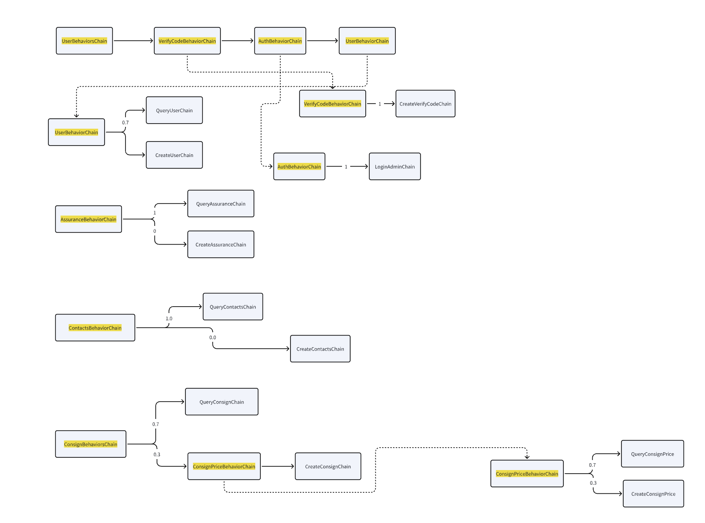
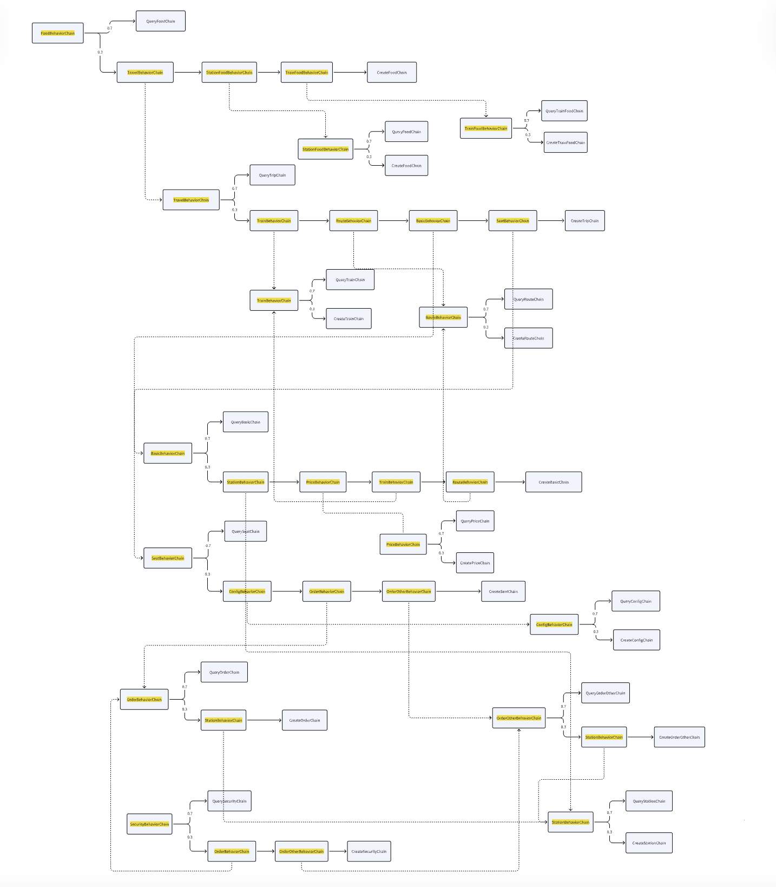

# LoadGenerator (base on 'Train-Ticket' Microservice Systems): A New Version loadgenerator for Microservice Systems
The Train-Ticket LoadGenerator is a dedicated tool designed to simulate traffic for the Train Ticket Booking System, which is based on a microservice architecture containing 41 microservices. This tool is primarily developed in Go, leveraging its performance and simplicity to effectively test and benchmark the system.

## Behavior Logic Graph



### Existing Behavior:
#### • Normal Preserve Chain

<div style="display: flex; flex-wrap: wrap; align-items: center; gap: 20px;">

  <!-- First Image and Arrow -->
  <div style="display: flex; align-items: center; margin-bottom: 20px;">
    
    <div style="font-size: 24px; color: gray; margin-left: 10px;">⟶</div>
  </div>

  <!-- Second Image and Arrow -->
  <div style="display: flex; align-items: center; margin-bottom: 20px;">
    
    <div style="font-size: 24px; color: gray; margin-left: 10px;">⟶</div>
  </div>

  <!-- Add more images and arrows as needed -->
  <div style="display: flex; align-items: center; margin-bottom: 20px;">
    
    <div style="font-size: 24px; color: gray; margin-left: 10px;">⟶</div>
  </div>

  <div style="display: flex; align-items: center; margin-bottom: 20px;">
    
    <div style="font-size: 24px; color: gray; margin-left: 10px;">⟶</div>
  </div>

  <div style="display: flex; align-items: center; margin-bottom: 20px;">
    
    <div style="font-size: 24px; color: gray; margin-left: 10px;">⟶</div>
  </div>

  <div style="display: flex; align-items: center; margin-bottom: 20px;">
    
    <div style="font-size: 24px; color: gray; margin-left: 10px;">⟶</div>
  </div>

  <div style="display: flex; align-items: center; margin-bottom: 20px;">
    
    <div style="font-size: 24px; color: gray; margin-left: 10px;">⟶</div>
  </div>

  <div style="display: flex; align-items: center; margin-bottom: 20px;">
    
    <div style="font-size: 24px; color: gray; margin-left: 10px;">⟶</div>
  </div>

  <div style="display: flex; align-items: center; margin-bottom: 20px;">
    
    <div style="font-size: 24px; color: gray; margin-left: 10px;">⟶</div>
  </div>

  <div style="display: flex; align-items: center; margin-bottom: 20px;">
    
    <div style="font-size: 24px; color: gray; margin-left: 10px;">⟶</div>
  </div>

  <div style="display: flex; align-items: center; margin-bottom: 20px;">
    
    
  </div>

</div>

---

#### • Normal Order Pay Chain

<div style="display: flex; flex-wrap: wrap; align-items: center; gap: 20px;">

  <!-- First Image and Arrow -->
  <div style="display: flex; align-items: center; margin-bottom: 20px;">
    
    <div style="font-size: 24px; color: gray; margin-left: 10px;">⟶</div>
  </div>

  <!-- Second Image and Arrow -->
  <div style="display: flex; align-items: center; margin-bottom: 20px;">
    
    <div style="font-size: 24px; color: gray; margin-left: 10px;">⟶</div>
  </div>


</div>

---

#### • Order Consign Chain

<div style="display: flex; flex-wrap: wrap; align-items: center; gap: 20px;">

  <!-- First Image and Arrow -->
  <div style="display: flex; align-items: center; margin-bottom: 20px;">
    
    <div style="font-size: 24px; color: gray; margin-left: 10px;">⟶</div>
  </div>

  <!-- Second Image and Arrow -->
  <div style="display: flex; align-items: center; margin-bottom: 20px;">
    
    <div style="font-size: 24px; color: gray; margin-left: 10px;">⟶</div>
  </div>


</div>

---

#### • Ticket Collect and Enter Station Chain

<div style="display: flex; flex-wrap: wrap; align-items: center; gap: 20px;">

  <!-- First Image and Arrow -->
  <div style="display: flex; align-items: center; margin-bottom: 20px;">
    
    <div style="font-size: 24px; color: gray; margin-left: 10px;">⟶</div>
  </div>

  <!-- Second Image and Arrow -->
  <div style="display: flex; align-items: center; margin-bottom: 20px;">
    
    <div style="font-size: 24px; color: gray; margin-left: 10px;">⟶</div>
  </div>


</div>

---

#### • Advanced Search Chain

<div style="display: flex; flex-wrap: wrap; align-items: center; gap: 20px;">

  <!-- First Image and Arrow -->
  <div style="display: flex; align-items: center; margin-bottom: 20px;">
    
    <div style="font-size: 24px; color: gray; margin-left: 10px;">⟶</div>
  </div>

  <!-- Second Image and Arrow -->
  <div style="display: flex; align-items: center; margin-bottom: 20px;">
    
    <div style="font-size: 24px; color: gray; margin-left: 10px;">⟶</div>
  </div>


</div>

---

#### • Consign List Chain

<div style="display: flex; flex-wrap: wrap; align-items: center; gap: 20px;">

  <!-- First Image and Arrow -->
  <div style="display: flex; align-items: center; margin-bottom: 20px;">
    
    <div style="font-size: 24px; color: gray; margin-left: 10px;">⟶</div>
  </div>

  <!-- Second Image and Arrow -->
  <div style="display: flex; align-items: center; margin-bottom: 20px;">
    
    <div style="font-size: 24px; color: gray; margin-left: 10px;">⟶</div>
  </div>


</div>

---

#### • Order Change Chain

<div style="display: flex; flex-wrap: wrap; align-items: center; gap: 20px;">

  <!-- First Image and Arrow -->
  <div style="display: flex; align-items: center; margin-bottom: 20px;">
    
    <div style="font-size: 24px; color: gray; margin-left: 10px;">⟶</div>
  </div>

  <!-- Second Image and Arrow -->
  <div style="display: flex; align-items: center; margin-bottom: 20px;">
    
    <div style="font-size: 24px; color: gray; margin-left: 10px;">⟶</div>
  </div>


</div>

---

#### • Order Cancel Chain

<div style="display: flex; flex-wrap: wrap; align-items: center; gap: 20px;">

  <!-- First Image and Arrow -->
  <div style="display: flex; align-items: center; margin-bottom: 20px;">
    
    <div style="font-size: 24px; color: gray; margin-left: 10px;">⟶</div>
  </div>

  <!-- Second Image and Arrow -->
  <div style="display: flex; align-items: center; margin-bottom: 20px;">
    
    <div style="font-size: 24px; color: gray; margin-left: 10px;">⟶</div>
  </div>


</div>

---

## Environment Setup and Deployment Guide
This guide provides the necessary steps to set up the environment and deploy the application.
#### Prerequisites
To get started, ensure you have the following installed and configured:
1. **Goland IDE**: Recommended for development with Go.
2. **Go Modules**: Run the following command to tidy up dependencies:
   ```bash
   go mod tidy
   ```
#### Deployment and Running the Application
To deploy and run the application, follow these steps:
1. Set the `BASE_URL` environment variable(Replace 'http://10.10.10.220:30080' with the corresponding address):
   ```powershell
   $env:BASE_URL = "http://10.10.10.220:30080"
   ```
2. Start the application:
   ```bash
   go run main.go
   ```
That's it! The application should now be running and accessible at the specified `BASE_URL`.


---

For any issues or further details, feel free to check the documentation or raise an issue in the repo :D
